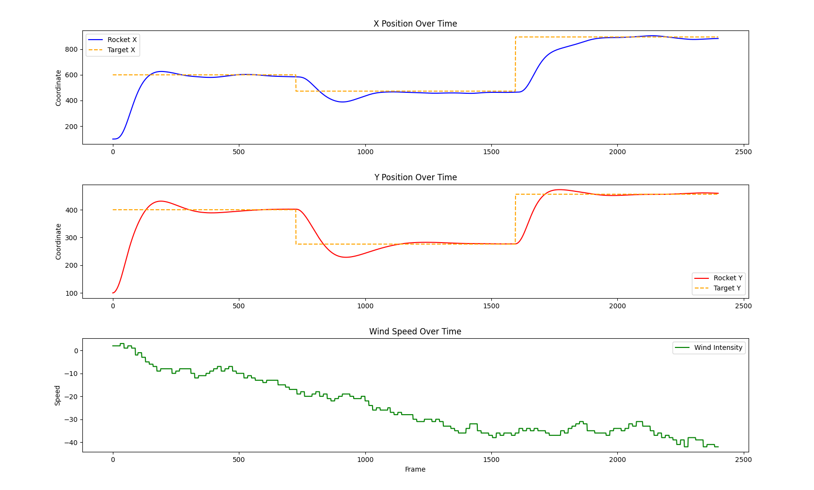
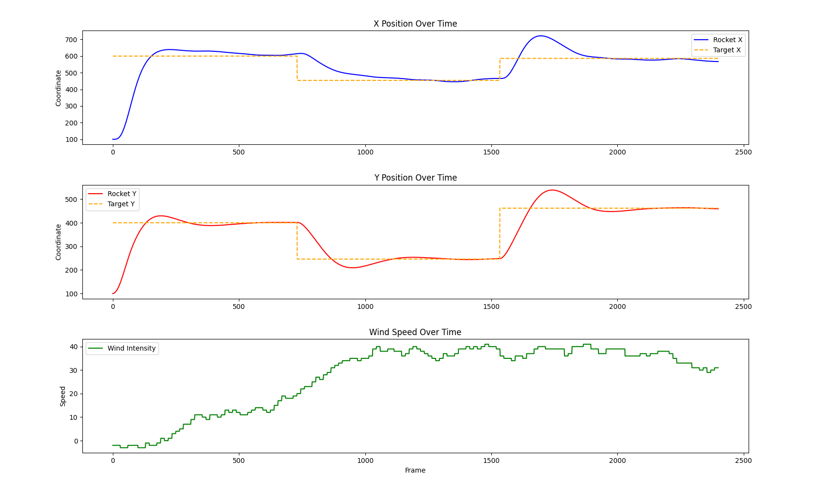

# Integral LQR-Control for 2D Rocket Stabilisation

## Overview
This is a simulation of a 2D rocket with 2 thrusters, one on the left side and one on the right side. The goal of this project is to have the rocket fly to a target and stay near that for a pre defined amount of time. The is also wind blowing which moves the rocket.

- The dynamics are modeled with inertia, mass and gravity.
- An integral LQR controller is used to move to targets.
- The targets are placed in random positions in the area.
- Wind is added as an extra obstacle to properly test the controller, the wind is random on each run.

https://github.com/user-attachments/assets/b2c3d54f-6902-49b2-adde-944b1f715dbf

## Dynamics
The rocket is modeled with 6 states: $x = [x, \dot{x}, y, \dot{y}, \theta, \dot{\theta}]^T$
This system is linearized around $\theta = 0$ using small angle approximation, because of this the rocket has to remain upright (within 20 degrees of 0) otherwise the system can become unstable.

To deal with the wind the state vector was augmented with the integral of the error of the position in the x and y direction. The feedback matrix was then calculated using Algebraic Riccati Equation. If the integral part is not added the rocket would be pushed by the wind and then keep flying next to the target instead of towards it.

## Code
- "rocket.py": Body dynamics and the visualisation of the rocket.
- "control.py": The implementation of the integral LQR controller.
- "wind.py": The creating and implementing of the wind.
- "environment.py": Creating the area where the drone flies and adding data onto the screen.
- "graph.py": Creating a graph of the x position, y position and wind strength over time.
- "config.py": Management of all the parameters of the simulation.

## Performance
The Eigenvalues of the closed loop system (A - BK) show that the all the poles are in the left plane, meaning that the system is stable:
[-3.78552764+3.78609672j, -3.78552764-3.78609672j, -0.50106957+0.83320828j,
 -0.50106957-0.83320828j, -0.94623421+0.j,         -0.44279119+0.74261001j,
 -0.44279119-0.74261001j, -0.84605625+0.j        ]

Here are the graphs of 2 different runs:

  

In these graphs it can be seen that the rocket can stay on target, and then fly to the next target without any problems. The settling time is about 350 frames, at 60 fps is about 5.8 seconds. The steady state error is less than 20 pixels. The overshoot can be pretty high especially in the x direction when the wind is blowing in an unfavourable direction, with it being up to 100 pixels. Overall the rocket performs well.
